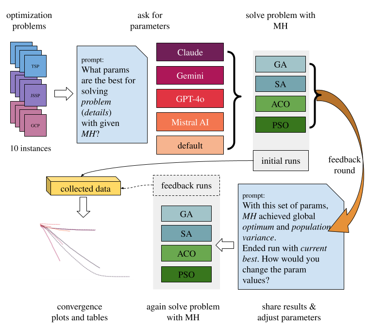

# LLMs as parameter tuners
This is the code repository associated with the paper:
"Tuning metaheuristic parameters with the use of Large Language Models"
2026



## Repository Structure

## Installation

## Data

## How to use it?

## Citation
```bibtex
@article{martinek2026tuning,
  title={Tuning metaheuristic parameters with the use of Large Language Models},
  author={Martinek A., Bartuzi-Trokielewicz E., Łukasik S., Gandomi A.},
  journal={},
  year={2026}
}
